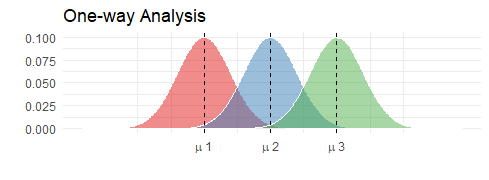

# tar



The goal of tar is to help make oneway analysis of variance (ANOVA) easier to run and interpret.

## Installation

You can install tar with:

``` r
if(!require("remotes")){
  install.packages("remotes")
  library("remotes")

remotes::install_github("tar")
```


## Example

You can run ANOVA by running functions:

``` r
library(tar)
anova <- oneway(mpg ~ cyl, mtcars)
plot(anova)
print(anova)
summary(anova)
```

